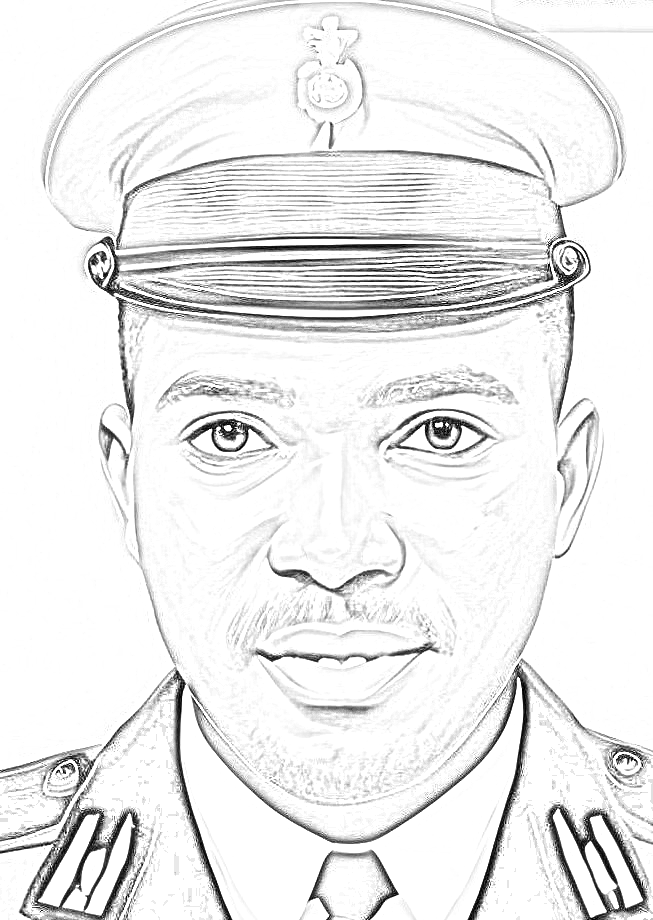

# Pencil Sketch Conversion

## Overview
The **Pencil Sketch Conversion** project is a simple Python application that allows users to convert images into pencil sketches. The application features a graphical user interface (GUI) built with Tkinter and uses OpenCV for image processing.

## Features
- Load an image using a file picker.
- Convert the image into a pencil sketch.
- Preview both the original and the converted sketch.
- Save the pencil sketch as a `.png` file.

## Project Structure
```
Pencil Sketch Conversion/
│── pencil_sketch.py          # Main Python script containing the code
│── requirements.txt          # List of required dependencies
│── officer.jpg               # Sample input image
│── sketch_image.png          # Sample output sketch image
└── README.md                 # Project documentation
```

## Installation
### Prerequisites
Ensure you have Python installed on your system. This project requires **Python 3.6+**.

### Steps
1. Clone the repository or download the files.
```sh
    git clone https://github.com/your-repo/pencil-sketch-conversion.git
    cd pencil-sketch-conversion
```

2. Install the required dependencies using:
```sh
    pip install -r requirements.txt
```

## Usage
1. Run the Python script to start the application:
```sh
    python pencil_sketch.py
```

2. Click on **"Open Image"** to select an image from your computer.
3. The image will be processed, and the pencil sketch version will be displayed.
4. Click on **"Save Sketch"** to save the converted image.

## Dependencies
The required dependencies are listed in `requirements.txt`. The project primarily uses:
- `opencv-python`
- `numpy`
- `pillow`
- `tkinter` (built-in with Python)

## Example Output
Original Image | Pencil Sketch
:-------------:|:-------------:
 | 

## License
This project is open-source and available under the MIT License.

## Author
Developed by **Michael Micah**. Contributions are welcome!

